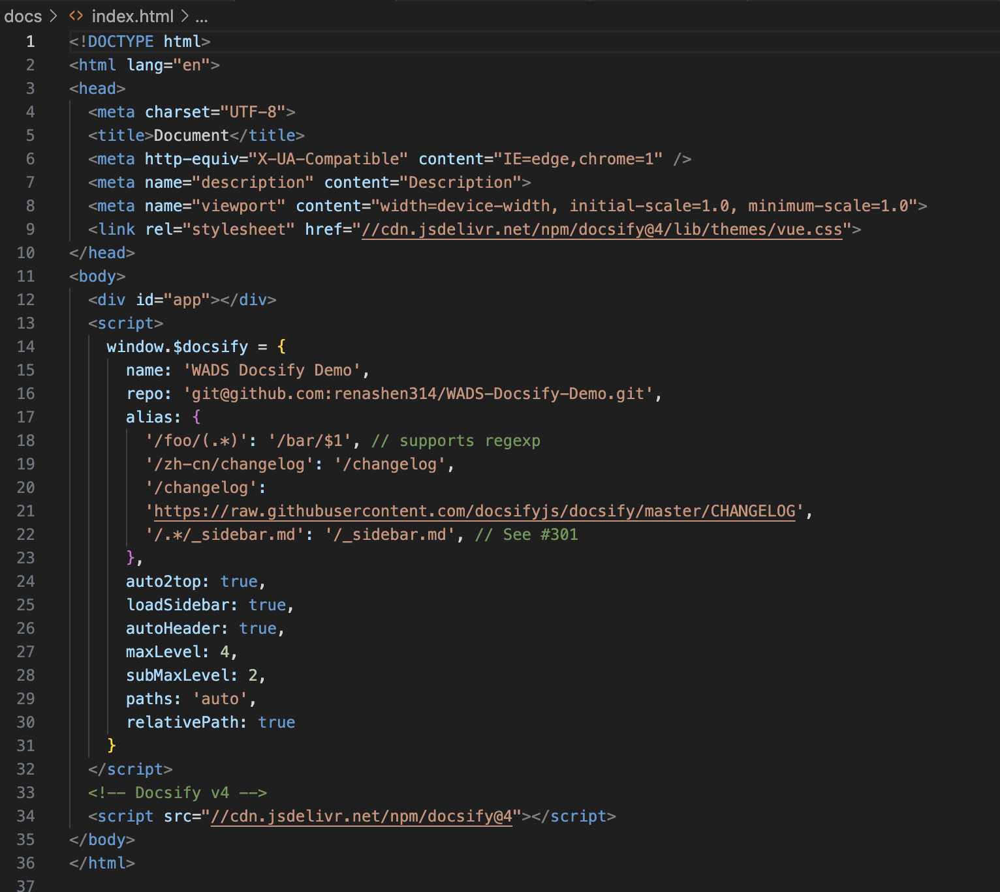
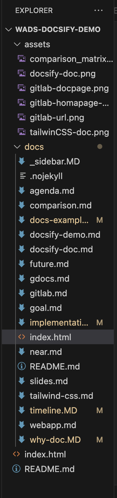

# Documentation is important!
**Communication is at the core of what W&ADS does.** It serves as the bridge between our apps and users.

Therefore, writing documentation is an essential part of application development. 

The **better** the documentation, the **easier** it is for users to start using the app. 
A good documentation should *reduce* the number of following:

1. Slack messages to seek support on “How to do this?” or simply saying “It doesn’t work, I don’t know why.”

2. People given up on using our application because it has no clear quick start instructions.

## Why Docsify?
Docsify is a documentation site generator.

It generates dynamically loads and parses markdown files and displays them on websites.

With a docsify template, our team can easily create, manage, and maintain documentation for apps.

## How does Docsify magic work?

